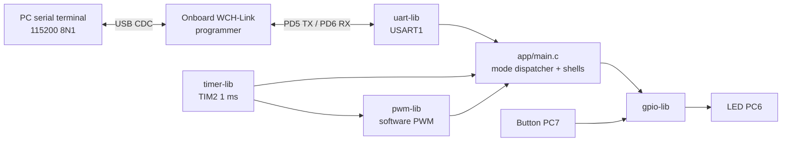

# Task 4 – UART-Scriptable LED Controller & Pattern Sequencer (VSDSquadron Mini)

A bare-metal firmware for the VSDSquadron Mini (CH32V003F4U6, RISC-V RV32EC) that turns the board into a
UART-controlled LED controller. From a serial terminal the user selects one of five modes: LED off, an
interactive LED/GPIO shell, a configurable "breathing" LED driven by software PWM, a **scriptable LED
pattern sequencer** (the user sends a bit pattern such as `10110011` with a step delay, and the board stores
it in a buffer and plays/stops it on command), and a button reaction-time game. All timing is non-blocking
and based on a 1 ms hardware timer, so the UART is polled continuously and commands are accepted while
animations run.

## Drivers used

| Driver | File | Hardware | Used for |
|---|---|---|---|
| GPIO  | [lib/gpio-lib.c](lib/gpio-lib.c) / [.h](lib/gpio-lib.h)   | PC6 (LED out), PC7 (button in), any PA/PC/PD pin (read) | LED on/off, button with debounce, `read <pin>` |
| UART  | [lib/uart-lib.c](lib/uart-lib.c) / [.h](lib/uart-lib.h)   | USART1, PD5 = TX, PD6 = RX | Command shell, status/score output |
| Timer | [lib/timer-lib.c](lib/timer-lib.c) / [.h](lib/timer-lib.h) | TIM2, free-running 16-bit, 1 kHz | ms time base for PWM, sequencer steps, reaction time |
| PWM   | [lib/pwm-lib.c](lib/pwm-lib.c) / [.h](lib/pwm-lib.h)     | Software PWM on the LED pin, clocked by TIM2 | Breathing effect with set duty / frequency / speed |

Application: [app/main.c](app/main.c).

### Pin map

| Signal | Pin | Notes |
|---|---|---|
| LED    | PC6 | Push-pull output, **active-high** (`1` = on) |
| Button | PC7 | Input with internal pull-up, **active-low**; connect a push button between PC7 and GND |
| UART TX | PD5 | USART1 default mapping |
| UART RX | PD6 | USART1 default mapping |

> The pushbuttons on the VSDSquadron Mini PCB are not connected to the CH32V003's PC7: SW1/SW2 belong to the
> onboard programmer chip and SW3 is the CH32V003 reset (PD7/NRST). An external button on PC7 is required for mode 4.

## Architecture



## API summary

**GPIO – `gpio-lib.h`**

| Function | Description |
|---|---|
| `void gpio_init(void)` | Enable GPIOC clock, configure PC6 as push-pull output |
| `void gpio_set(uint8_t state)` | Drive the LED pin (`1` = on, `0` = off) |
| `void gpio_clear(void)` / `void toggle_blink_led(void)` | LED off / toggle |
| `void button_init(void)` | Configure PC7 as input with pull-up (`BTN_ACTIVE_HIGH 0`) or pull-down (`1`) |
| `uint8_t button_pressed(void)` | Raw pressed state, polarity-corrected |
| `uint8_t button_pressed_debounced(void)` | Pressed only if still pressed after `BTN_DEBOUNCE_MS` (20 ms) |
| `void button_wait_release(void)` | Block until released continuously for 20 ms |
| `int8_t gpio_read_pin(const char *pin)` | Read a pin by name (`"C6"`, `"d3"`, `"A2"`) as floating input; returns `0`/`1`, `-1` if invalid |

**UART – `uart-lib.h`** (USART1, `USART_BAUD_RATE` = 115200)

| Function | Description |
|---|---|
| `void usart1_init(void)` | Configure PD5/PD6 and USART1, 115200 8N1, TX+RX |
| `void usart1_write_2byte(uint16_t data)` / `uint16_t usart1_read_2byte(void)` | Blocking single-character write / read |
| `uint8_t usart1_available(void)` | `1` if a received byte is waiting (RXNE) |
| `void usart1_write_string(const char *s)` | Send a C string, wait for transmit complete |
| `void usart1_write_uint(uint32_t v)` | Send an unsigned decimal number |
| `void usart1_read_string(char *buf, uint16_t max)` | Blocking line read until CR or LF |

**Timer – `timer-lib.h`**

| Function | Description |
|---|---|
| `void timer_ms_init(void)` | TIM2 prescaler = `SystemCoreClock/1000 - 1`, free-running up-counter, 1 tick = 1 ms |
| `uint16_t timer_ms(void)` | Current counter value; wraps every 65.536 s, so use `(uint16_t)(now - start)` for intervals |

**PWM – `pwm-lib.h`**

| Function | Description |
|---|---|
| `void pwm_breathe_init(pwm_breathe_t *p, uint8_t max_duty, uint16_t freq_hz, uint32_t speed_ms)` | Initialise the PWM/breathing state |
| `uint8_t pwm_breathe_set_duty(p, 0..100)` | Peak brightness in %; returns `0` if out of range |
| `uint8_t pwm_breathe_set_freq(p, 1..500)` | PWM frequency in Hz |
| `uint8_t pwm_breathe_set_speed(p, 100..60000)` | Ramp time off→peak in ms (one full breath = 2×) |
| `uint8_t pwm_breathe_tick(p)` | Call once per 1 ms; returns `1` if the output should be on |

## Build + flash

Requirements: [PlatformIO](https://platformio.org/) (VS Code extension or CLI) with the `ch32v` platform, and the
board connected over USB-C (the onboard WCH-Link is used for flashing and as the USB-serial bridge).

```bash
cd vsdsquadron-mini-core/task4/submission
pio run                      # build
pio run -t upload            # flash via onboard WCH-Link
pio device monitor -b 115200 # open serial terminal
```

[platformio.ini](platformio.ini) builds `app/main.c` together with the flat driver sources in `lib/`
(`src_dir = app`, `build_src_filter = +<*> +<../lib/*.c>`, `-I lib`).

## UART settings

| Setting | Value |
|---|---|
| Peripheral | USART1 (TX = PD5, RX = PD6) |
| Baud | 115200 |
| Format | 8 data bits, no parity, 1 stop bit (8N1), no flow control |
| Port | USB-serial of the onboard WCH-Link: `/dev/ttyACM0` on Linux, `COMx` on Windows |
| Line ending | CR, LF or CR+LF (all accepted) |

## How to demo

Open the terminal at 115200 and reset the board. The board prints:

```
ready. cmd: mode <0..4>
```

Select a mode with `mode <n>` (or just the digit). Every mode returns to this menu with `exit`.

### Mode 0 – LED off
```
mode 0
```
LED stays off; send any line to return to the menu.

### Mode 1 – LED / GPIO shell
```
mode 1
led on
led off
blink 250          # blink with 250 ms half-period; press any key to stop
read C7            # prints C7=0 or C7=1
help
exit
```

### Mode 2 – Breathing LED (software PWM)
```
mode 2
set duty 60        # peak brightness 60 %
set freq 100       # PWM frequency 100 Hz
set speed 1000     # 1 s ramp up, 1 s ramp down
help
exit
```
Each accepted command replies `ok`; out-of-range values reply with the valid ranges.

### Mode 3 – LED pattern sequencer (scriptable over UART)
```
mode 3
set pattern 10110011 200   # store pattern in buffer, 200 ms per step
pattern play               # loop the pattern ('1' = LED on, '0' = LED off)
set pattern 1010 100       # change pattern while playing (restarts at step 0)
pattern stop               # stop, LED off
exit
```
Patterns are 1–32 characters of `0`/`1`, steps are 1–10000 ms. The pattern is kept in a static buffer, so it
survives leaving and re-entering mode 3.

### Mode 4 – Reaction-time game (needs a button PC7 → GND)
```
mode 4
```
1. The board prints a timer self-check (`timer check (expect ~1000): N`).
2. Press the button (or send any key) to start a round; `wait for the LED...` is printed.
3. After a random 1–5 s delay the LED turns on – press the button as fast as possible.
4. The board prints `reaction: <ms> ms` and the best time. Pressing early prints `FALSE START!`;
   no press within 5 s prints `timeout`.
5. Type `exit` (while waiting to start) to return to the menu.

## Known limitations

- PWM is software PWM with 1 ms resolution: at high frequencies the duty steps are coarse
  (e.g. at 500 Hz the 2 ms period only allows 0/50/100 %).
- `read <pin>` reconfigures the pin as a floating input; `read C6` disables the LED output until reset.
- `timer_ms()` is 16-bit, so single intervals must stay below 65.5 s.
